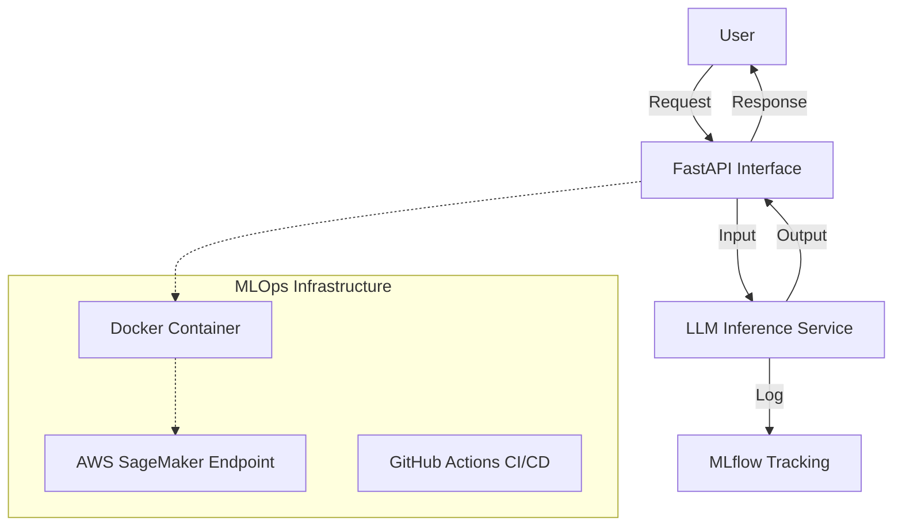

# End-to-End LLM Application with MLOps

## 📌 Project Overview
We are building a production-grade **LLM Application** that demonstrates the full lifecycle of a Machine Learning model. This project moves beyond simple Jupyter notebooks to a real-world system architecture used by top tech companies.

### Key Features
- **LLM Inference API**: A FastAPI-based REST API to serve model predictions.
- **Experiment Tracking**: Integrated with **MLflow** to track parameters, metrics, and model versions.
- **Containerization**: Fully Dockerized application for consistent environments.
- **Cloud Deployment**: Deployed on **AWS SageMaker** for scalable inference.
- **CI/CD Pipeline**: Automated deployment using **GitHub Actions**.
- **Monitoring**: Real-time performance monitoring.

---
## 🌟 Core Architecture
The system is built on three main pillars:
1.  **FastAPI Inference Service**: A high-performance REST API that serves a language model (e.g., `distilgpt2`) for real-time text generation.
2.  **MLflow Tracking Dashboard**: Every request is logged as an "experiment run," tracking parameters (like `max_length`), metrics (like `latency`), and model versions for full observability.
3.  **Scalable Infrastructure**: The app is **Dockerized** for consistency and prepared for deployment to **AWS SageMaker** via automated CI/CD pipelines.

## 🛠️ Key Components & Features
- **Interactive API Docs**: Automatic Swagger UI at `http://127.0.0.1:5000/docs`.
- **In-Depth Tracking**: MLflow UI at `http://127.0.0.1:5001` to monitor latency and model behavior.
- **Advanced User Management**: Includes expanded profile fields (First Name, Last Name, DOB, Phone) and a secure password recovery flow with OTP.
- **One-Click Execution**: A `run.bat` script that handles environment checks and launches both servers concurrently.

## 🎯 How It Works
1.  **Request**: A user sends a prompt to the FastAPI `/generate` endpoint.
2.  **Inference**: The model generates text while MLflow logs the performance metrics.
3.  **Response**: The system returns the generated text and immediately updates the tracking dashboard.

## 🚀 Quick Start
To run the entire suite on your local machine:
1.  Open a terminal in the project root.
2.  Execute the startup script:
    ```bash
    .\run.bat
    ```
3.  Access the API at `http://127.0.0.1:5000/docs` and MLflow at `http://127.0.0.1:5001`.

---
**Goal**: Mastery of End-to-End MLOps for LLMs.
**Developer**: Ashwin


## 🏗️ System Architecture



## 🚀 Getting Started

### Prerequisites
- Python 3.9+
- Docker
- AWS Account (optional for local dev, required for deployment)

### Installation
1. **Clone the repository**
   ```bash
   git clone <repo-url>
   cd "End-to-End LLM Application with MLOps"
   ```

2. **Create a virtual environment**
   ```bash
   python -m venv venv
   source venv/bin/activate  # On Windows: venv\Scripts\activate
   ```

3. **Install dependencies**
   ```bash
   pip install -r requirements.txt
   ```

### Running Locally
1. **Start the API**
   ```bash
   uvicorn app.main:app --reload
   ```
   Visit `http://localhost:8000/docs` to see the Swagger UI.

2. **Run MLflow UI**
   ```bash
   mlflow ui
   ```
   Visit `http://localhost:5000` to view experiments.

## ☁️ Deployment to AWS SageMaker (Status: Pending Verification)

> **Note**: The deployment scripts are ready, but actual deployment is currently paused pending AWS Account Identity Verification.

### Deployment Preview
Once the account is active, the following results are expected:

**1. Terminal Output Success:**


**2. AWS SageMaker Console (Active Endpoint):**


### Steps to Finalize Deployment
1.  **Complete AWS Registration**: Verify phone number and payment method on AWS Console.
2.  **Configure AWS Credentials**:
    ```bash
    aws configure
    ```
3.  **Build and Push Docker Image**:
    ```bash
    # Login to ECR
    aws ecr get-login-password --region us-east-1 | docker login --username AWS --password-stdin <YOUR_AWS_ACCOUNT_ID>.dkr.ecr.us-east-1.amazonaws.com

    # Build and Tag
    docker build -t llm-app .
    docker tag llm-app:latest <YOUR_AWS_ACCOUNT_ID>.dkr.ecr.us-east-1.amazonaws.com/llm-app:latest

    # Push
    docker push <YOUR_AWS_ACCOUNT_ID>.dkr.ecr.us-east-1.amazonaws.com/llm-app:latest
    ```
4.  **Deploy**:
    ```bash
    python deploy.py
    ```

## 🛠️ Tech Stack
| Component | Tool Used | Description |
|-----------|-----------|-------------|
| **Model** | Hugging Face Transformers | Pre-trained LLM (GPT-2/DistilGPT2) |
| **API** | FastAPI | High-performance API framework |
| **Tracking** | MLflow | Experiment tracking & model registry |
| **Container** | Docker | Application packaging |
| **Cloud** | AWS SageMaker | Scalable model deployment |
| **CI/CD** | GitHub Actions | Automated specific workflows |

## 📝 Project Methodology
1. **Select Model**: Choose a lightweight LLM for cost-effective demonstration.
2. **Build API**: Wrap the model in a FastAPI service.
3. **Track Experiments**: Log every run with MLflow to ensure reproducibility.
4. **Dockerize**: Package the app and dependencies.
5. **Deploy**: Push to AWS SageMaker for production availability.
6. **Monitor**: Track system health and model performance.

---
**Author**: Ashwin
**Goal**: Mastery of End-to-End MLOps for LLMs.


